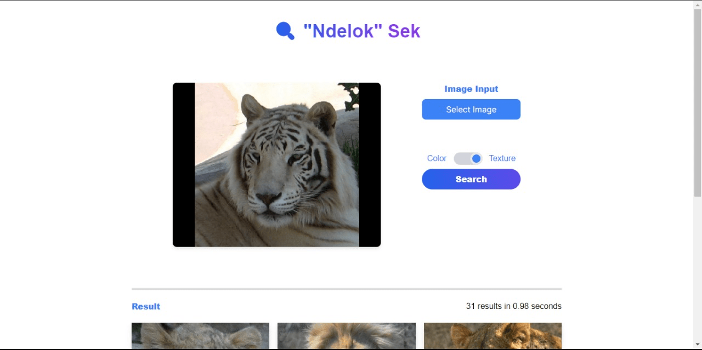

# Algeo02-22135

<h2 align="center">
  🟥🟧🟨🟩🟦🟪 Simple CBIR Program 🟥🟧🟨🟩🟦🟪  
</h2>

> Watch the Live demo [_here_](https://youtu.be/4xGEtr984sA?si=t4HYkChpMQwviq6U).

## Table of Contents

- [Deskripsi Permasalahan](#Deksripsi-Permasalahan)
- [Anggota Kelompok](#Anggota-Kelompok)
- [Fitur](#Fitur)
- [Libraries Yang Digunakan](#Libraries-Yang-Digunakan)
- [Cara Menggunakan](#Cara-Menggunakan)
- [Screenshot](#Screenshot)
- [Project Status](#project-status)
- [Acknowledgements](#acknowledgements)

## Deskripsi Permasalahan

Content-Based Image Retrieval (CBIR) merupakan proses pencarian dan pengambilan gambar berdasarkan konten visualnya. Tahapan awalnya melibatkan ekstraksi fitur-fitur utama dari gambar seperti warna, tekstur, dan bentuk. Fitur-fitur ini kemudian diubah menjadi vektor atau deskripsi numerik yang bisa dibandingkan dengan gambar lain.

Pada projek ini, akan dibuat program CBIR menggunakan parameter warna dan tekstur. Program ini akan diimplementasikan dalam website lokal yang menerima input gambar yang ingin dibandingkan beserta folder dataset yang menjadi pembanding

## Anggota Kelompok

| NIM      | Nama                       | Tanggung Jawab         |
| -------- | -------------------------- | ---------------------- |
| 13522135 | Christian Justin Hendrawan | Algoritma CBIR warna   |
| 13522143 | Muhammad Fatihul Irhab     | Algoritma CBIR tekstur |
| 13522146 | M. Zaidan sa’dun R.        | Front-End website      |

## Fitur

1. CBIR Colour
2. CBIR Tekstur

## Libraries Yang Digunakan

- OpenCV
- NumPy
- FastAPI
- NextJS
- React

## Cara Menggunakan

1. Clone github, buka terminal
2. Ganti directory ke websitefe
3. Install semua dependencies yang diperlukan seperti, npm i, install node js
4. Lalu jalankan frontend dengan cara npm run dev
5. Buka terminal baru
6. Ganti directory ke backend
7. Install semua dependencies yang diperlukan seperti, pip install -r rec.txt, pastikan anda sudah menginstall python, jika belum install terlebih dahulu
8. Lalu jalankan backend dengan cara python -m uvicorn main:app
9. Buka link web pada frontend, web siap digunakan

Note: mungkin akan terdapat kesalahan saat menjalankan backend, hal ini bisa terjadi karena ip addrres belum ditambahkan di database, mohon untuk contact salah satu dari kami, terimakasih.

## Screenshot

.

## Project Status

Project is: _complete_

## Acknowledgements

Terima kasih sebesar-besarnya kepada :

- Tuhan YME
- Asisten lab IRK
- Dosen pengampu IF2123 Dr. Ir. Rinaldi Munir, M.T.
